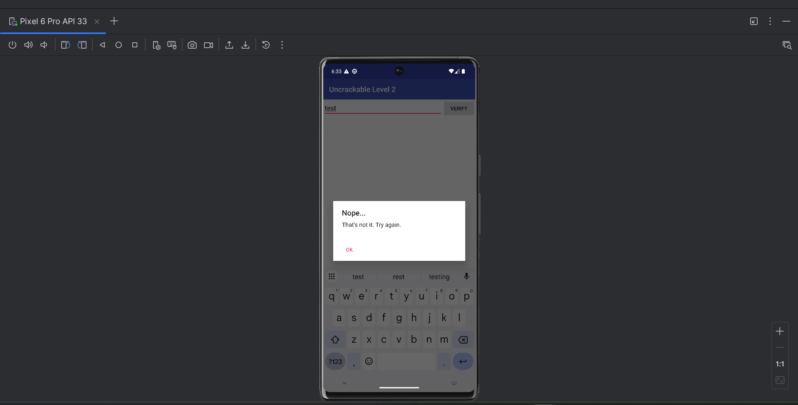
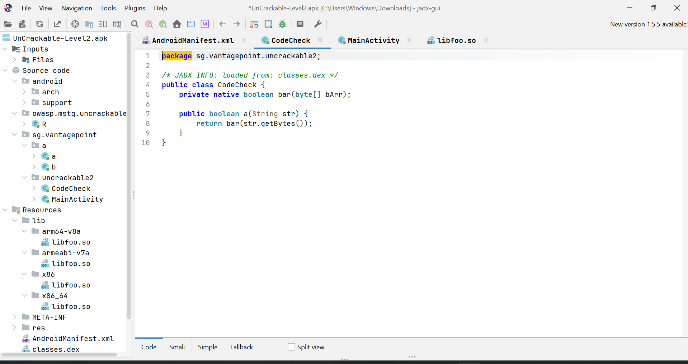
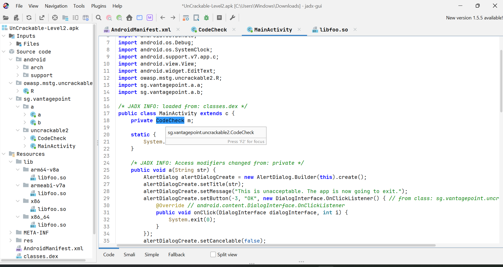
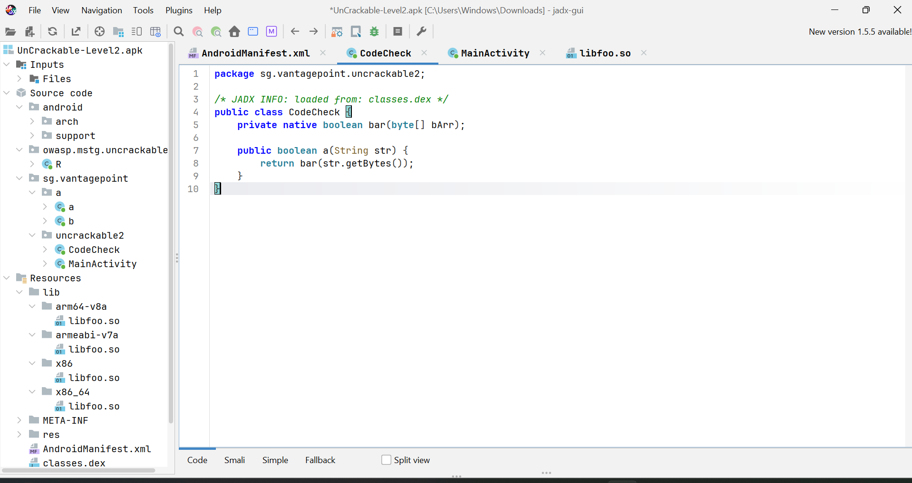
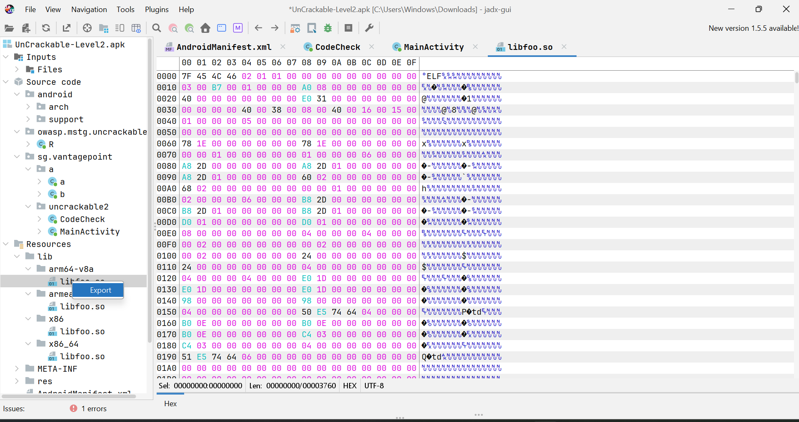
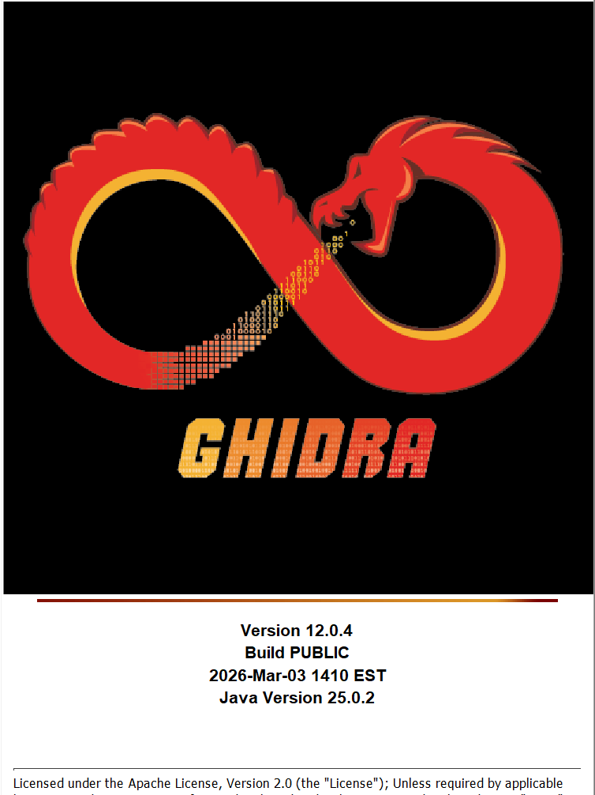
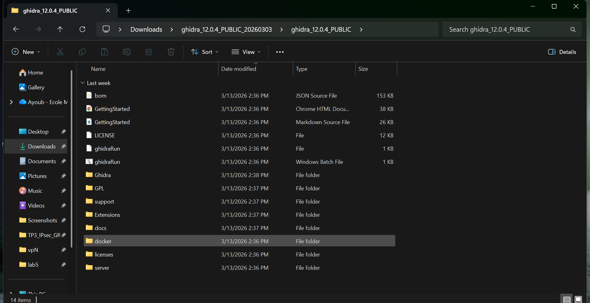
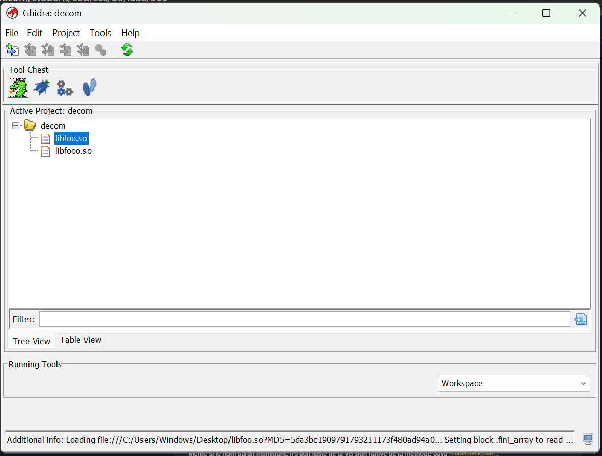
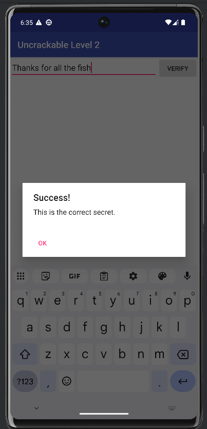

# LAB 5 — Reverse Engineering : UnCrackable Level 2

## Objectifs du lab

Ce laboratoire a pour but d'explorer les mécanismes de protection d'une application Android utilisant du code natif. À travers cette analyse, on cherche à :

- Identifier le chargement d'une bibliothèque native via `System.loadLibrary`
- Comprendre la déclaration d'une méthode native en Java
- Localiser le fichier `.so` embarqué dans l'APK
- Importer la bibliothèque dans Ghidra pour analyse statique
- Retrouver la fonction JNI exportée responsable de la vérification
- Repérer l'appel à `strncmp` utilisé pour comparer des chaînes
- Décoder la valeur hexadécimale ASCII représentant le secret
- Valider le secret retrouvé directement dans l'application

---

## Partie 1 — Installation et lancement de l'APK

L'APK `UnCrackable-Level2.apk` est installé sur un émulateur Android (Pixel 6 Pro, API 33). Au lancement, l'application affiche un simple champ de saisie accompagné d'un bouton **VERIFY**.

Toute entrée incorrecte déclenche un message d'échec :



---

## Partie 2 — Décompilation avec JADX

L'APK est ouvert dans **JADX-GUI** (version 1.5.4). La structure du projet révèle plusieurs packages intéressants, notamment `sg.vantagepoint.uncrackable2`.



Dans `MainActivity`, on constate que la vérification s'effectue via un appel à `m.a(str)`, où `m` est une instance de `CodeCheck`.



---

## Partie 3 — Analyse de la classe CodeCheck

En ouvrant la classe `CodeCheck`, on observe la structure suivante :

```java
public class CodeCheck {
    private native boolean bar(byte[] bArr);

    public boolean a(String str) {
        return bar(str.getBytes());
    }
}
```

La méthode `a(String)` convertit la chaîne en tableau d'octets et la transmet à la méthode **native** `bar`. Cette méthode native est implémentée dans une bibliothèque `.so`, elle ne peut pas être analysée directement depuis le bytecode Java.



---

## Partie 4 — Localisation de la bibliothèque native

Dans la section **Resources > lib** de l'APK, on retrouve la bibliothèque `libfoo.so` compilée pour plusieurs architectures :

- `arm64-v8a`
- `armeabi-v7a`
- `x86`
- `x86_64`

Pour extraire le fichier, un clic droit sur `libfoo.so` dans JADX permet d'utiliser l'option **Export** afin de sauvegarder le binaire sur le disque.



---

## Partie 5 — Analyse du code natif avec Ghidra

### Installation de Ghidra

La version utilisée est **Ghidra 12.0.4 PUBLIC** (build du 2026-Mar-03), basée sur Java 25.0.2.



Le répertoire d'installation contient les dossiers habituels : `Ghidra`, `GPL`, `Extensions`, `docs`, ainsi que les scripts de lancement `ghidraRun` et `ghidraRun.bat`.



### Import de libfoo.so dans Ghidra

Un nouveau projet nommé `decom` est créé. Le fichier `libfoo.so` est importé via **File > Import File**. Ghidra détecte automatiquement le format ELF ARM 64-bit et charge le binaire.



Le fichier `libfoo.so` apparaît bien dans l'arbre du projet, prêt à être analysé avec le décompilateur.

### Analyse de la fonction `bar` (Java_sg_vantagepoint_uncrackable2_CodeCheck_bar)

Après analyse automatique, on localise la fonction JNI correspondant à la méthode native `bar`. Dans le décompilateur Ghidra, le code C reconstruit révèle un appel à `strncmp` entre l'entrée utilisateur et une chaîne stockée en mémoire.

La chaîne de comparaison est encodée sous forme de valeurs hexadécimales ASCII. En la décodant et en tenant compte de l'ordre des octets (inversion éventuelle), on obtient le secret.

---

## Partie 6 — Décodage et validation

### Décodage des octets hexadécimaux

Les octets extraits depuis Ghidra sont convertis de leur représentation hexadécimale vers des caractères ASCII lisibles.

### Résultat

Après décodage et éventuelle inversion de l'ordre des octets, le secret obtenu est :

```
Thanks for all the fish
```

### Validation dans l'application

Le secret est saisi dans le champ de l'application, puis le bouton **VERIFY** est pressé. L'application affiche la boîte de dialogue de succès :



---

## Outils utilisés

| Outil | Version | Rôle |
|---|---|---|
| JADX-GUI | 1.5.4 | Décompilation du bytecode Java |
| Ghidra | 12.0.4 PUBLIC | Analyse du code natif ARM |
| Android Emulator | Pixel 6 Pro API 33 | Test de l'application |

---

## Conclusion

Cette analyse démontre qu'une protection basée uniquement sur du code natif (`.so`) ne suffit pas à résister à l'analyse statique. Ghidra permet de reconstruire le code C depuis le binaire ELF et d'identifier la logique de comparaison, rendant possible la récupération du secret sans jamais exécuter le code.
